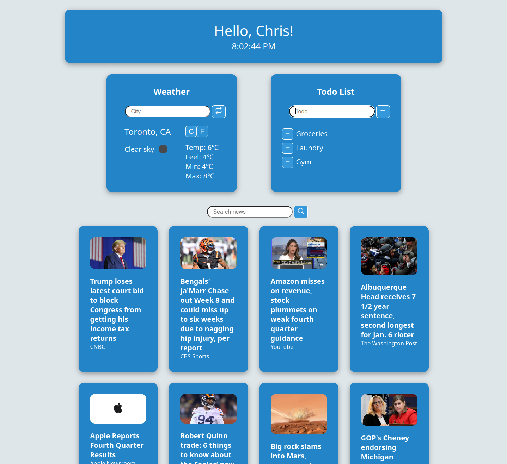

# React Homepage

Browser homepage using React

## About

React Homepage is a basic homepage app for web browsers to replace the standard browser homepage.
It displays a greeting, the current time, the current weather in the specified city, a todo list, and a searchable news feed.
Weather temperatures can toggle between C and F with a group of toggle buttons.
Written while learning React to practice API calls.

## Requirements

- NodeJS
- OpenWeatherMap API account & key (free)
- NewsAPI API account & key (free)

## Setup

1. Clone repository:
`git clone https://github.com/cw417/react-homepage.git`
2. Change into client folder and install npm packages:
  `cd react-homepage/client/ && npm install`
3. Create a `.env` file to hold the necessary API keys:
`echo "REACT_APP_WEATHER_API_KEY=''\nREACT_APP_NEWS_API_KEY=''" > .env`
4. Get API keys from [OpenWeatherMap](https://openweathermap.org/price) and [NewsAPI](https://newsapi.org/)
    - Both services have development free-tiers for their API keys
5. In `.env`, copy/paste the API keys between `''` for each key
6. Start the app:
`npm start`
7. The page can be accessed at `localhost:3000` on your web browser (or possibly a different port, if specified by Node)

## Usage

- When first opening the page, the user will be prompted to enter their name to set the greeting.
- The weather component can change cities with the "City" input.
- The todo list component can add todos with the "Todo" input, or remove them with the `-` button.
- The news feed displays the current top 20 most popular articles from the United States by default.
  - The news feed can be filtered to top 20 articles matching a given keyword with the "Search news" input.

## Examples

